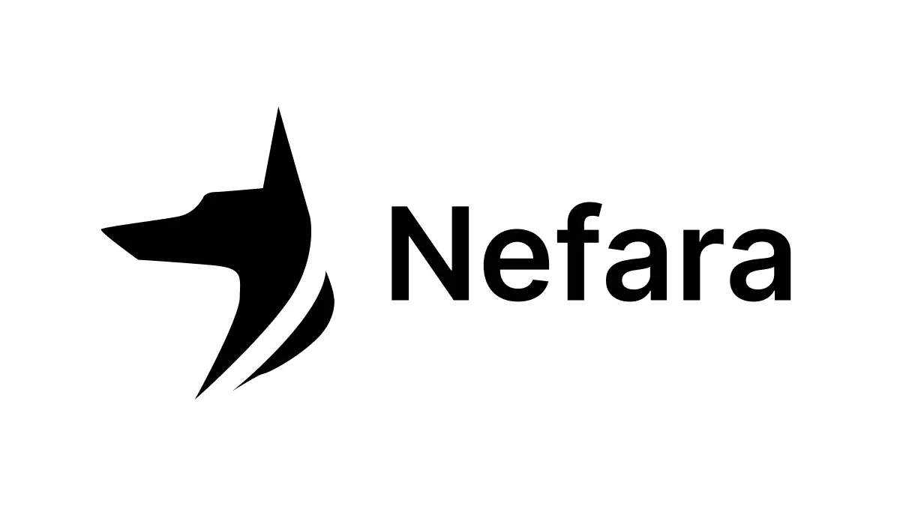

# Nefara

<div align="center">
  
  
  **Building Digital Excellence Since 2024**
  
  Transform your ideas into powerful digital experiences. We craft exceptional websites, desktop applications, and mobile apps that drive real business results.
</div>

---

## 🌟 Overview

Nefara is a modern, full-stack web application showcasing a software development company's services. The platform features a beautiful, responsive design with internationalization support, contact form functionality, and a comprehensive service portfolio.

### Key Features

- 🌍 **Multilingual Support** - English and Bulgarian (Български) language support
- 📱 **Fully Responsive** - Optimized for desktop, tablet, and mobile devices
- 🎨 **Modern UI/UX** - Built with Material-UI and custom theming
- 📧 **Contact Form** - Integrated contact form with email functionality
- 🚀 **High Performance** - Built with Next.js 16 and React 19
- 🐳 **Docker Ready** - Containerized for easy deployment
- ✅ **Test Coverage** - Comprehensive unit and integration tests

## 🛠️ Tech Stack

### Frontend (Client)
- **Framework**: Next.js 16.0.1
- **React**: 19.1.1
- **UI Library**: Material-UI (MUI) 7.3.1
- **Internationalization**: next-intl 4.5.0
- **Animation**: Motion 12.23.12
- **Email**: Nodemailer 7.0.11
- **Testing**: Vitest 4.0.15, React Testing Library

### Backend (Server)
- **Framework**: Spring Boot 3.5.4
- **Java**: 17
- **Build Tool**: Maven
- **Email**: Spring Boot Mail Starter
- **Validation**: Spring Boot Validation Starter

## 📁 Project Structure

```
Nefara-Web/
├── client/                 # Next.js frontend application
│   ├── src/
│   │   ├── app/           # Next.js app router pages
│   │   ├── components/    # React components
│   │   ├── actions/       # Server actions
│   │   ├── services/      # Service layer
│   │   ├── utils/         # Utility functions
│   │   ├── i18n/          # Internationalization config
│   │   ├── messages/      # Translation files (en.json, bg.json)
│   │   └── theme/         # Material-UI theme configuration
│   ├── public/            # Static assets (logos, images)
│   ├── Dockerfile         # Client Docker configuration
│   └── package.json
│
└── server/                # Spring Boot backend application
    ├── src/
    │   └── main/
    │       ├── java/      # Java source code
    │       └── resources/ # Application properties
    ├── Dockerfile         # Server Docker configuration
    └── pom.xml           # Maven configuration
```

## 🚀 Getting Started

### Prerequisites

- **Node.js** 24+ (for client)
- **Java** 17+ (for server)
- **Maven** 3.6+ (for server)
- **Docker** (optional, for containerized deployment)

### Installation

1. **Clone the repository**
   ```bash
   git clone <repository-url>
   cd Nefara-Web
   ```

2. **Install client dependencies**
   ```bash
   cd client
   npm install
   ```

3. **Build server (if needed)**
   ```bash
   cd server
   mvn clean install
   ```

## ⚙️ Environment Variables

### Client Environment Variables

Create a `.env.local` file in the `client/` directory:

```env
# Client URL (required for metadata and links)
NEXT_PUBLIC_CLIENT_URL=http://localhost:3000

# Contact Information (optional, for display)
NEXT_PUBLIC_CONTACT_EMAIL=contact@nefara.com
NEXT_PUBLIC_CONTACT_PHONE=+359123456789

# SMTP Configuration (required for contact form)
SMTP_HOST=smtp.example.com
SMTP_PORT=587
SMTP_USER=your-email@example.com
SMTP_PASS=your-password
```

### Server Environment Variables

Set the following environment variables for the Spring Boot server:

```env
# Application Name
SPRING_APPLICATION_NAME=nefara-server

# Email Configuration
PRIVATEEMAIL_HOST=smtp.example.com
PRIVATEEMAIL_PORT=587
PRIVATEEMAIL_EMAIL=your-email@example.com
PRIVATEEMAIL_PASSWORD=your-password

# CORS Configuration
CORS_ALLOW_ORIGINS=http://localhost:3000
```

## 🏃 Running the Application

### Development Mode

**Client:**
```bash
cd client
npm run dev
```
The client will be available at `http://localhost:3000`

**Server:**
```bash
cd server
mvn spring-boot:run
```
The server will be available at `http://localhost:8080`

### Production Build

**Client:**
```bash
cd client
npm run build
npm start
```

**Server:**
```bash
cd server
mvn clean package
java -jar target/server-0.0.1-SNAPSHOT.jar
```

## 🐳 Docker Deployment

### Build Docker Images

**Client:**
```bash
cd client
docker build -t nefara-client .
```

**Server:**
```bash
cd server
mvn clean package
docker build -t nefara-server .
```

### Run with Docker

**Client:**
```bash
docker run -p 3000:3000 \
  -e NEXT_PUBLIC_CLIENT_URL=http://localhost:3000 \
  -e SMTP_HOST=your-smtp-host \
  -e SMTP_PORT=587 \
  -e SMTP_USER=your-email \
  -e SMTP_PASS=your-password \
  nefara-client
```

**Server:**
```bash
docker run -p 8080:8080 \
  -e SPRING_APPLICATION_NAME=nefara-server \
  -e PRIVATEEMAIL_HOST=your-smtp-host \
  -e PRIVATEEMAIL_PORT=587 \
  -e PRIVATEEMAIL_EMAIL=your-email \
  -e PRIVATEEMAIL_PASSWORD=your-password \
  -e CORS_ALLOW_ORIGINS=http://localhost:3000 \
  nefara-server
```

## 🧪 Testing

### Client Tests

Run unit and integration tests:
```bash
cd client
npm test
```

The project includes comprehensive test coverage for:
- Contact form functionality
- Email validation and utilities
- Environment variable validation
- Integration tests for contact service

## 📝 Available Scripts

### Client Scripts
- `npm run dev` - Start development server
- `npm run build` - Build for production
- `npm start` - Start production server
- `npm run lint` - Run ESLint
- `npm test` - Run tests with Vitest

### Server Scripts
- `mvn clean install` - Build the project
- `mvn spring-boot:run` - Run the application
- `mvn test` - Run tests

## 🌐 Internationalization

The application supports multiple languages:
- **English** (`/en`) - Default
- **Bulgarian** (`/bg`) - Български

Language files are located in `client/src/messages/`:
- `en.json` - English translations
- `bg.json` - Bulgarian translations

## 📦 Services Offered

The platform showcases the following services:

1. **Web Development** - Modern, responsive websites and web applications
2. **Mobile Apps** - Cross-platform mobile applications
3. **Desktop Applications** - Native desktop software for Windows, macOS, and Linux
4. **AI Solutions** - Custom AI development and integration

## 🤝 Contributing

Contributions are welcome! Please feel free to submit a Pull Request.

## 📄 License

This project is proprietary and confidential. All rights reserved.

## 📧 Contact

For inquiries, please use the contact form on the website or reach out directly.

---

<div align="center">
  <p>Built with ❤️ by Nefara</p>
  <p>© 2024 Nefara - All rights reserved.</p>
</div>

